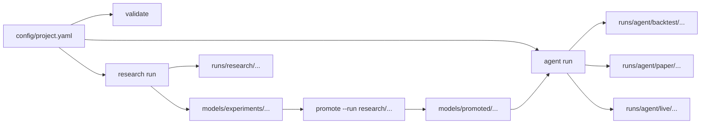

# QuantTradeAI

> Quant research workflows and trading agents from one YAML project.

QuantTradeAI is a YAML-first, CLI-first framework for traders, researchers, and developers who want a practical path from market data to research runs, backtests, and trading agents. The happy path is intentionally simple: define one project, run it from the CLI, and inspect standardized artifacts for every run.

[Getting Started](docs/getting-started.md) | [Project YAML](docs/configuration/project-yaml.md) | [Quick Reference](docs/quick-reference.md) | [Configuration](docs/configuration.md) | [Roadmap](roadmap.md) | [Contributing](CONTRIBUTING.md)

> [!TIP]
> New users should start with `config/project.yaml`. It is the canonical entrypoint for `init`, `validate`, `research run`, and `agent run`.

## Start Here

- Want the fastest working path? Jump to [Research In 4 Commands](#research-in-4-commands)
- Already have a trained model? Jump to [Run A Model Agent](#run-a-model-agent)
- Evaluating prompt-driven agents? Jump to [Run An LLM Agent](#run-an-llm-agent)
- Need the full config shape? Jump to [What A Project Looks Like](#what-a-project-looks-like)
- Comparing current capabilities? Jump to [Current Support](#current-support)

## Why QuantTradeAI

- **One project file**: keep research and agents in the same `config/project.yaml`
- **One clear CLI**: initialize, validate, run research, and run agents with a small command surface
- **Shared primitives**: reuse symbols, features, and time windows across workflows
- **Run visibility by default**: each run writes resolved configs, metrics, and artifacts to disk
- **YAML first, Python extendable**: common workflows require little or no framework code

## At A Glance

| I want to... | Best path today | What I get |
| --- | --- | --- |
| Research a strategy end to end | `init` -> `validate` -> `research run` -> `promote --run research/<run_id>` | Time-aware evaluation, backtests, metrics, run records, and a stable promoted model path |
| Run a deterministic rule agent | `init --template rule-agent` -> `agent run --mode backtest` -> `promote` -> `agent run --mode paper` -> `promote --to live` -> `agent run --mode live` | A YAML-only agent that can move through backtest, paper, and live with explicit promotion gates |
| Run a trained model as an agent | `init --template model-agent` -> `validate` -> `agent run --mode backtest` -> `promote` -> `agent run --mode paper` -> `promote --to live` -> `agent run --mode live` | One YAML-defined model agent wired to a stable `models/promoted/...` path that can be backtested, promoted, paper-run, and live-run |
| Run an LLM agent | `init --template llm-agent` -> `agent run --mode backtest` -> `promote` -> `agent run --mode paper` -> `promote --to live` -> `agent run --mode live` | Prompt-driven agent logic using project config across all three modes |
| Run a hybrid agent | `init --template hybrid` -> `research run` -> `promote --run research/<run_id>` -> `agent run --mode backtest` -> `promote` -> `agent run --mode paper` -> `promote --to live` -> `agent run --mode live` | Model signals plus LLM reasoning in one project, with research outputs promoted into a stable path before the agent is promoted through environments |
| Run every project agent together | `agent run --all --mode backtest|paper --max-concurrency 4` | A local multi-agent batch that preserves normal child runs plus batch-level manifests and scoreboards |
| Sweep one agent across parameter variants | `agent run --sweep rsi_threshold_grid --mode backtest --max-concurrency 4` | A local sweep batch that expands one agent into many backtest variants, preserves normal child runs, and ranks them with the same scoreboard flow |
| Generate a Docker Compose deployment bundle | `deploy --agent <name> --target docker-compose` | A real-time paper-agent bundle with compose, Dockerfile, env placeholders, and resolved config |
| Keep using the older live loop | `live-trade` with runtime YAML files | Legacy compatibility for existing setups |

## How It Fits Together



QuantTradeAI is one framework with two connected tracks:

- **Research**: data -> features -> labels -> training -> evaluation -> backtest -> run records
- **Agents**: YAML-defined `rule`, `model`, `llm`, and `hybrid` agents that reuse the same project definitions

## Current Support

| Workflow | Status |
| --- | --- |
| `research run` from `project.yaml` | Supported |
| `agent run` for `rule` agents in `backtest` | Supported |
| `agent run` for `rule` agents in `paper` | Supported |
| `agent run` for `rule` agents in `live` | Supported |
| `agent run` for `model` agents in `backtest` | Supported |
| `agent run` for `model` agents in `paper` | Supported |
| `agent run` for `model` agents in `live` | Supported |
| `agent run` for `llm` and `hybrid` agents in `backtest` | Supported |
| `agent run` for `llm` and `hybrid` agents in `paper` | Supported |
| `agent run` for `llm` and `hybrid` agents in `live` | Supported |
| Research-run promotion to stable model paths | Supported |
| Agent backtest-to-paper promotion | Supported |
| Agent paper-to-live promotion with acknowledgement | Supported |
| `agent run --all --mode backtest` from `project.yaml` | Supported |
| `agent run --all --mode paper` from `project.yaml` | Supported |
| `agent run --sweep <name> --mode backtest` from `project.yaml` | Supported |
| `deploy --target docker-compose` for paper agents | Supported |
| `live-trade` legacy runtime YAML workflow | Supported for compatibility |

> [!NOTE]
> `agent run --mode live` is the canonical live path for project-defined agents. `live-trade` still exists for legacy runtime YAML workflows and does not read `config/project.yaml`.

## Install In 2 Minutes

QuantTradeAI requires Python `3.11+`.

```bash
git clone https://github.com/AKKI0511/QuantTradeAI.git
cd QuantTradeAI
poetry install --with dev
poetry run quanttradeai --help
```

If you prefer a package install, `pip install .` also works.

## Fastest Working Paths

Local `agent run --mode paper` now defaults to deterministic historical replay through `data.streaming.replay`. If you do not set explicit replay dates, QuantTradeAI uses `data.test_start` and `data.test_end`, then falls back to `data.start_date` and `data.end_date`.

### Research In 4 Commands

Use this if you want the simplest end-to-end quant workflow.

```bash
poetry run quanttradeai init --template research -o config/project.yaml
poetry run quanttradeai validate -c config/project.yaml
poetry run quanttradeai research run -c config/project.yaml
poetry run quanttradeai runs list
poetry run quanttradeai runs list --scoreboard --sort-by net_sharpe
```

This path gives you:

- a canonical project config
- resolved-config validation output
- a research run with metrics and artifacts
- standardized outputs under `runs/research/...`
- a quick scoreboard view for ranking local runs by the metrics that matter

To make a winning research artifact available to model or hybrid agents through a stable path:

```bash
poetry run quanttradeai promote --run research/<run_id> -c config/project.yaml
```

### Run A Rule Agent

Use this if you want the smallest deterministic agent workflow with no LLM dependency.

```bash
poetry run quanttradeai init --template rule-agent -o config/project.yaml
poetry run quanttradeai validate -c config/project.yaml
poetry run quanttradeai agent run --agent rsi_reversion -c config/project.yaml --mode backtest
poetry run quanttradeai promote --run agent/backtest/<run_id> -c config/project.yaml
poetry run quanttradeai agent run --agent rsi_reversion -c config/project.yaml --mode paper
poetry run quanttradeai promote --run agent/paper/<run_id> -c config/project.yaml --to live --acknowledge-live rsi_reversion
poetry run quanttradeai agent run --agent rsi_reversion -c config/project.yaml --mode live
```

The default template wires a simple RSI threshold rule through YAML only:

```yaml
agents:
  - name: "rsi_reversion"
    kind: "rule"
    mode: "paper"
    rule:
      preset: "rsi_threshold"
      feature: "rsi_14"
      buy_below: 30.0
      sell_above: 70.0
```

### Run A Model Agent

Use this if you already have a trained model artifact and want one YAML-defined agent that can run in backtest, paper, and live mode.

```bash
poetry run quanttradeai init --template model-agent -o config/project.yaml
poetry run quanttradeai validate -c config/project.yaml

# Replace models/promoted/aapl_daily_classifier/ with a real trained model artifact

poetry run quanttradeai agent run --agent paper_momentum -c config/project.yaml --mode backtest
poetry run quanttradeai promote --run agent/backtest/<run_id> -c config/project.yaml
poetry run quanttradeai agent run --agent paper_momentum -c config/project.yaml --mode paper
poetry run quanttradeai promote --run agent/paper/<run_id> -c config/project.yaml --to live --acknowledge-live paper_momentum
poetry run quanttradeai agent run --agent paper_momentum -c config/project.yaml --mode live
```

> [!IMPORTANT]
> The `model-agent` template creates a placeholder directory at `models/promoted/aapl_daily_classifier/`. Replace it with a promoted research model artifact or another compatible saved model before running the agent.

### Run An LLM Agent

Use this if you want prompt-driven agent logic from YAML and want to move the same agent definition from backtest into paper and live mode.

```bash
poetry run quanttradeai init --template llm-agent -o config/project.yaml
poetry run quanttradeai validate -c config/project.yaml
poetry run quanttradeai agent run --agent breakout_gpt -c config/project.yaml --mode backtest
poetry run quanttradeai promote --run agent/backtest/<run_id> -c config/project.yaml
poetry run quanttradeai agent run --agent breakout_gpt -c config/project.yaml --mode paper
poetry run quanttradeai promote --run agent/paper/<run_id> -c config/project.yaml --to live --acknowledge-live breakout_gpt
poetry run quanttradeai agent run --agent breakout_gpt -c config/project.yaml --mode live
```

### Run A Hybrid Agent

Use this if you want to combine trained model signals and LLM reasoning in one project and then promote the same agent through paper and live mode.

```bash
poetry run quanttradeai init --template hybrid -o config/project.yaml
poetry run quanttradeai validate -c config/project.yaml
poetry run quanttradeai research run -c config/project.yaml
poetry run quanttradeai promote --run research/<run_id> -c config/project.yaml
poetry run quanttradeai agent run --agent hybrid_swing_agent -c config/project.yaml --mode backtest
poetry run quanttradeai promote --run agent/backtest/<run_id> -c config/project.yaml
poetry run quanttradeai agent run --agent hybrid_swing_agent -c config/project.yaml --mode paper
poetry run quanttradeai promote --run agent/paper/<run_id> -c config/project.yaml --to live --acknowledge-live hybrid_swing_agent
poetry run quanttradeai agent run --agent hybrid_swing_agent -c config/project.yaml --mode live
```

The default hybrid template is prewired to `models/promoted/aapl_daily_classifier`, so you do not need to hand-edit timestamped experiment paths after the research run.

### Run Every Project Agent

Use this when one `config/project.yaml` defines several agents and you want one local batch run that keeps the normal child runs intact.

```bash
poetry run quanttradeai agent run --all -c config/project.yaml --mode backtest
poetry run quanttradeai agent run --all -c config/project.yaml --mode backtest --max-concurrency 4
poetry run quanttradeai agent run --all -c config/project.yaml --mode paper
poetry run quanttradeai agent run --all -c config/project.yaml --mode paper --max-concurrency 4
```

This writes batch artifacts under `runs/agent/batches/<timestamp>_<project>_backtest/` or `runs/agent/batches/<timestamp>_<project>_paper/`:

- `batch_manifest.json`
- `results.json`
- `scoreboard.json`
- `scoreboard.txt`

Each child agent still writes its normal run under `runs/agent/backtest/...` or `runs/agent/paper/...`, so `quanttradeai runs list --scoreboard` continues to work without a separate comparison path. Backtest batches rank by `net_sharpe`; paper batches rank by `total_pnl`.

### Sweep One Agent

Use this when you want to evaluate a small grid of backtest-only parameter variants for one agent without mutating your checked-in project config.

```bash
poetry run quanttradeai agent run --sweep rsi_threshold_grid -c config/project.yaml --mode backtest
poetry run quanttradeai agent run --sweep rsi_threshold_grid -c config/project.yaml --mode backtest --max-concurrency 4
```

Add the sweep to `config/project.yaml`:

```yaml
sweeps:
  - name: "rsi_threshold_grid"
    kind: "agent_backtest"
    agent: "rsi_reversion"
    parameters:
      - path: "rule.buy_below"
        values: [25.0, 30.0]
      - path: "rule.sell_above"
        values: [70.0, 75.0]
```

This writes batch artifacts under `runs/agent/batches/<timestamp>_<project>_<sweep>_backtest/` plus one normal child run per expanded variant under `runs/agent/backtest/...`.

Sweep child runs are intentionally not promotable. Copy the winning parameters into `config/project.yaml`, rerun that agent normally, and then promote the non-sweep run.

### Deploy A Paper Agent

Use this if you want a generated Docker Compose bundle for a project-defined paper agent.

```bash
poetry run quanttradeai deploy --agent breakout_gpt -c config/project.yaml --target docker-compose
```

This writes a deployment bundle under `reports/deployments/<agent>/<timestamp>/` with:

- `docker-compose.yml`
- `Dockerfile`
- `.env.example`
- `README.md`
- `resolved_project_config.yaml`
- `deployment_manifest.json`

Generated deployment bundles always disable replay in the emitted resolved project config and expect real-time streaming credentials. Local replay-backed paper runs stay unchanged in your source `config/project.yaml`.

## What A Project Looks Like

The happy path is centered on `config/project.yaml`.

```yaml
project:
  name: "intraday_lab"
  profile: "paper"

data:
  symbols: ["AAPL"]
  start_date: "2022-01-01"
  end_date: "2024-12-31"
  timeframe: "1d"
  test_start: "2024-09-01"
  test_end: "2024-12-31"
  streaming:
    enabled: true
    provider: "alpaca"
    websocket_url: "wss://stream.data.alpaca.markets/v2/iex"
    auth_method: "api_key"
    symbols: ["AAPL"]
    channels: ["trades", "quotes"]
    replay:
      enabled: true
      pace_delay_ms: 0

features:
  definitions:
    - name: "rsi_14"
      type: "technical"
      params: { period: 14 }

agents:
  - name: "paper_momentum"
    kind: "model"
    mode: "paper"
    model:
      path: "models/promoted/aapl_daily_classifier"
```

For the full shape, field reference, and supported agent modes, see [Project YAML](docs/configuration/project-yaml.md).

## What You Get After Each Run

| Workflow | Output directory | Typical artifacts |
| --- | --- | --- |
| Research | `runs/research/<timestamp>_<project>/` | `resolved_project_config.yaml`, runtime YAML snapshots, `summary.json`, `metrics.json`, backtest artifacts |
| Agent backtest | `runs/agent/backtest/<timestamp>_<agent>/` | `resolved_project_config.yaml`, `summary.json`, `metrics.json`, `decisions.jsonl`, backtest files |
| Agent paper | `runs/agent/paper/<timestamp>_<agent>/` | `resolved_project_config.yaml`, `summary.json`, `metrics.json`, `decisions.jsonl`, `executions.jsonl`, runtime YAML snapshots, and `replay_manifest.json` when replay is enabled |
| Agent live | `runs/agent/live/<timestamp>_<agent>/` | `resolved_project_config.yaml`, `summary.json`, `metrics.json`, `decisions.jsonl`, `executions.jsonl`, runtime streaming/risk/position-manager YAML snapshots |

Sweep batch artifacts:

- `runs/agent/batches/<timestamp>_<project>_<sweep>_backtest/batch_manifest.json`
- `runs/agent/batches/<timestamp>_<project>_<sweep>_backtest/results.json`
- `runs/agent/batches/<timestamp>_<project>_<sweep>_backtest/scoreboard.json`
- `runs/agent/batches/<timestamp>_<project>_<sweep>_backtest/scoreboard.txt`

This makes it easier to compare runs, audit what actually executed, and reuse winning configurations.

To compare local runs directly from the CLI, use the metrics-aware scoreboard:

```bash
poetry run quanttradeai runs list --scoreboard
poetry run quanttradeai runs list --scoreboard --sort-by net_sharpe
poetry run quanttradeai runs list --type agent --mode live --scoreboard --sort-by total_pnl
```

## Documentation Map

### Start Here

- [Getting Started](docs/getting-started.md)
- [Quick Reference](docs/quick-reference.md)

### Configuration

- [Configuration Overview](docs/configuration.md)
- [Project YAML](docs/configuration/project-yaml.md)
- [Runtime and Live Trading Configs](docs/configuration/live-runtime-files.md)
- [Legacy Config Compatibility](docs/configuration/legacy-configs.md)

### Reference

- [API Docs](docs/api/)
- [Docs Index](docs/README.md)

### Product Direction

- [Roadmap](roadmap.md)

## Legacy Compatibility

`config/project.yaml` is the recommended path for new work. Legacy workflows remain available for compatibility, especially for saved-model backtests and the older live trading loop.

```bash
poetry run quanttradeai fetch-data -c config/model_config.yaml
poetry run quanttradeai train -c config/model_config.yaml
poetry run quanttradeai evaluate -m <model_dir> -c config/model_config.yaml
poetry run quanttradeai backtest-model -m <model_dir> -c config/model_config.yaml -b config/backtest_config.yaml
poetry run quanttradeai live-trade -m <model_dir> -c config/model_config.yaml -s config/streaming.yaml
poetry run quanttradeai validate-config
```

Important boundary:

- `agent run --mode paper` for project-defined agents uses replay from `config/project.yaml` when `data.streaming.replay.enabled: true`
- `agent run --mode live` for project-defined `rule`, `model`, `llm`, and `hybrid` agents compiles runtime config from `config/project.yaml`
- `deploy --target docker-compose` generates a real-time paper bundle and disables replay in the emitted deployment config
- `live-trade` still uses the legacy runtime YAML files directly

## Development

```bash
poetry install --with dev
make format
make lint
make test
```

## Contributing

See [CONTRIBUTING.md](CONTRIBUTING.md).

## License

MIT. See [LICENSE](LICENSE).
