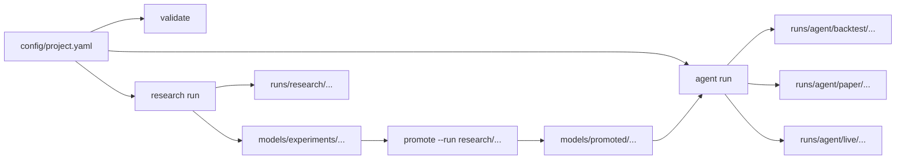

# QuantTradeAI

> Quant research workflows and trading agents from one YAML project.

QuantTradeAI is a YAML-first, CLI-first framework for traders, researchers, and developers who want a practical path from market data to research runs, backtests, and trading agents. The happy path is intentionally simple: define one project, run it from the CLI, and inspect standardized artifacts for every run.

[Getting Started](docs/getting-started.md) | [Project YAML](docs/configuration/project-yaml.md) | [Quick Reference](docs/quick-reference.md) | [Configuration](docs/configuration.md) | [Roadmap](roadmap.md) | [Contributing](CONTRIBUTING.md)

> [!TIP]
> New users should start with `config/project.yaml`. It is the canonical entrypoint for `init`, `validate`, `research run`, and `agent run`.

## Start Here

- Want the fastest working path? Jump to [Research In 4 Commands](#research-in-4-commands)
- Want a multi-strategy lab? Jump to [Run The Strategy Lab](#run-the-strategy-lab)
- Already have a trained model? Jump to [Run A Model Agent](#run-a-model-agent)
- Evaluating prompt-driven agents? Jump to [Run An LLM Agent](#run-an-llm-agent)
- Need the full config shape? Jump to [What A Project Looks Like](#what-a-project-looks-like)
- Comparing current capabilities? Jump to [Current Support](#current-support)

## Why QuantTradeAI

- **One project file**: keep research and agents in the same `config/project.yaml`
- **One clear CLI**: initialize, validate, run research, and run agents with a small command surface
- **Shared primitives**: reuse symbols, features, and time windows across workflows
- **Run visibility by default**: each run writes resolved configs, metrics, and artifacts to disk
- **YAML first, Python extendable**: common workflows require little or no framework code

## At A Glance

| I want to... | Best path today | What I get |
| --- | --- | --- |
| Research a strategy end to end | `init` -> `validate` -> `research run` -> `promote --run research/<run_id>` | Time-aware evaluation, backtests, metrics, run records, and a stable promoted model path |
| Compare multiple deterministic strategies | `init --template strategy-lab` -> `validate` -> `agent run --all --mode backtest` -> `agent run --sweep ...` -> `promote` | RSI reversion and SMA trend agents, reusable sweeps, run scoreboards, and promotion without Python, LLM keys, or broker credentials |
| Run a deterministic rule agent | `init --template rule-agent` -> `agent run --mode backtest` -> `promote` -> `agent run --mode paper` -> `promote --to live` -> `agent run --mode live` | A YAML-only agent that can move through backtest, paper, and live with explicit promotion gates |
| Run a trained model as an agent | `init --template model-agent` -> `validate` -> `agent run --mode backtest` -> `promote` -> `agent run --mode paper` -> `promote --to live` -> `agent run --mode live` | One YAML-defined model agent wired to a stable `models/promoted/...` path that can be backtested, promoted, paper-run, and live-run |
| Run an LLM agent | `init --template llm-agent` -> `agent run --mode backtest` -> `promote` -> `agent run --mode paper` -> `promote --to live` -> `agent run --mode live` | Prompt-driven agent logic using project config across all three modes |
| Run a hybrid agent | `init --template hybrid` -> `research run` -> `promote --run research/<run_id>` -> `agent run --mode backtest` -> `promote` -> `agent run --mode paper` -> `promote --to live` -> `agent run --mode live` | Model signals plus LLM reasoning in one project, with research outputs promoted into a stable path before the agent is promoted through environments |
| Run every project agent together | `agent run --all --mode backtest|paper|live --max-concurrency 4` | A local multi-agent batch that preserves normal child runs plus `summary.json.run_result`, `results.json`, and `scoreboard.json` |
| Sweep one agent across parameter variants | `agent run --sweep rsi_threshold_grid --mode backtest --max-concurrency 4` | A local sweep batch that expands one agent into many backtest variants, preserves normal child runs, and ranks them with the same scoreboard flow |
| Generate a QuantTradeAI deployment bundle | `deploy --agent <name> --target local|docker-compose|render --mode paper|live` | A local runner, Docker Compose bundle, or Render worker bundle for a promoted paper or live agent |

## How It Fits Together



QuantTradeAI is one framework with two connected tracks:

- **Research**: data -> features -> labels -> training -> evaluation -> backtest -> run records
- **Agents**: YAML-defined `rule`, `model`, `llm`, and `hybrid` agents that reuse the same project definitions

## Current Support

| Workflow | Status |
| --- | --- |
| `research run` from `project.yaml` | Supported |
| `agent run` for `rule` agents in `backtest` | Supported |
| `agent run` for `rule` agents in `paper` | Supported |
| `agent run` for `rule` agents in `live` | Supported |
| `agent run` for `model` agents in `backtest` | Supported |
| `agent run` for `model` agents in `paper` | Supported |
| `agent run` for `model` agents in `live` | Supported |
| `agent run` for `llm` and `hybrid` agents in `backtest` | Supported |
| `agent run` for `llm` and `hybrid` agents in `paper` | Supported |
| `agent run` for `llm` and `hybrid` agents in `live` | Supported |
| Research-run promotion to stable model paths | Supported |
| Agent backtest-to-paper promotion | Supported |
| Agent paper-to-live promotion with acknowledgement | Supported |
| `init --template strategy-lab` with two rule agents and sweeps | Supported |
| `agent run --all --mode backtest` from `project.yaml` | Supported |
| `agent run --all --mode paper` from `project.yaml` | Supported |
| `agent run --all --mode live` from `project.yaml` with acknowledgement | Supported |
| `agent run --sweep <name> --mode backtest` from `project.yaml` | Supported |
| Batch `summary.json.run_result` contracts and `runs list --type batch` | Supported |
| `deploy --target local` for paper or live agents | Supported |
| `deploy --target docker-compose` for paper or live agents | Supported |
| `deploy --target render` for paper or live agents | Supported |
## Install In 2 Minutes

QuantTradeAI requires Python `3.11+`.

```bash
git clone https://github.com/AKKI0511/QuantTradeAI.git
cd QuantTradeAI
poetry install --with dev
poetry run quanttradeai --help
```

If you prefer a package install, `pip install .` also works.

## Fastest Working Paths

Local `agent run --mode paper` now defaults to deterministic historical replay through `data.streaming.replay`. If you do not set explicit replay dates, QuantTradeAI uses `data.test_start` and `data.test_end`, then falls back to `data.start_date` and `data.end_date`.

If you want real broker submission for happy-path paper or live runs, set `agents[].execution.backend: alpaca`. That switches execution from local simulated fills to Alpaca-backed market orders, requires real-time Alpaca streaming, and writes broker account and position snapshots into the run directory.

### Research In 4 Commands

Use this if you want the simplest end-to-end quant workflow.

```bash
poetry run quanttradeai init --template research -o config/project.yaml
poetry run quanttradeai validate -c config/project.yaml
poetry run quanttradeai research run -c config/project.yaml
poetry run quanttradeai runs list
poetry run quanttradeai runs list --scoreboard --sort-by net_sharpe
poetry run quanttradeai runs list --compare research/<run_id_a> --compare research/<run_id_b>
```

This path gives you:

- a canonical project config
- resolved-config validation output
- a research run with metrics and artifacts
- standardized outputs under `runs/research/...`
- a quick scoreboard view for ranking local runs by the metrics that matter
- an artifact-backed compare flow for inspecting meaningful config deltas between shortlisted runs

To make a winning research artifact available to model or hybrid agents through a stable path:

```bash
poetry run quanttradeai promote --run research/<run_id> -c config/project.yaml
```

### Run A Rule Agent

Use this if you want the smallest deterministic agent workflow with no LLM dependency.

```bash
poetry run quanttradeai init --template rule-agent -o config/project.yaml
poetry run quanttradeai validate -c config/project.yaml
poetry run quanttradeai agent run --agent rsi_reversion -c config/project.yaml --mode backtest
poetry run quanttradeai promote --run agent/backtest/<run_id> -c config/project.yaml
poetry run quanttradeai agent run --agent rsi_reversion -c config/project.yaml --mode paper
poetry run quanttradeai promote --run agent/paper/<run_id> -c config/project.yaml --to live --acknowledge-live rsi_reversion
poetry run quanttradeai agent run --agent rsi_reversion -c config/project.yaml --mode live
```

The default template wires a simple RSI threshold rule through YAML only:

```yaml
agents:
  - name: "rsi_reversion"
    kind: "rule"
    mode: "paper"
    execution:
      backend: "simulated"
    rule:
      preset: "rsi_threshold"
      feature: "rsi_14"
      buy_below: 30.0
      sell_above: 70.0
```

### Run The Strategy Lab

Use this when you want a ready-made QuantTradeAI lab that can compare more than one deterministic strategy from YAML.

```bash
poetry run quanttradeai init --template strategy-lab -o config/project.yaml
poetry run quanttradeai validate -c config/project.yaml
poetry run quanttradeai agent run --all -c config/project.yaml --mode backtest --max-concurrency 4
poetry run quanttradeai agent run --sweep rsi_threshold_grid -c config/project.yaml --mode backtest --max-concurrency 4
poetry run quanttradeai agent run --sweep sma_risk_grid -c config/project.yaml --mode backtest --max-concurrency 4
poetry run quanttradeai runs list --scoreboard --sort-by net_sharpe
poetry run quanttradeai promote --run agent/backtest/<winning_run_id> -c config/project.yaml
```

The template includes `rsi_reversion` and `sma_trend`. The SMA agent is fully YAML-defined:

```yaml
agents:
  - name: "sma_trend"
    kind: "rule"
    mode: "paper"
    rule:
      preset: "sma_crossover"
      fast_feature: "sma_20"
      slow_feature: "sma_50"
    context:
      features: ["sma_20", "sma_50"]
      positions: true
      risk_state: true
```

### Run A Model Agent

Use this if you already have a trained model artifact and want one YAML-defined agent that can run in backtest, paper, and live mode.

```bash
poetry run quanttradeai init --template model-agent -o config/project.yaml
poetry run quanttradeai validate -c config/project.yaml

# Replace models/promoted/aapl_daily_classifier/ with a real trained model artifact

poetry run quanttradeai agent run --agent paper_momentum -c config/project.yaml --mode backtest
poetry run quanttradeai promote --run agent/backtest/<run_id> -c config/project.yaml
poetry run quanttradeai agent run --agent paper_momentum -c config/project.yaml --mode paper
poetry run quanttradeai promote --run agent/paper/<run_id> -c config/project.yaml --to live --acknowledge-live paper_momentum
poetry run quanttradeai agent run --agent paper_momentum -c config/project.yaml --mode live
```

> [!IMPORTANT]
> The `model-agent` template creates a placeholder directory at `models/promoted/aapl_daily_classifier/`. Replace it with a promoted research model artifact or another compatible saved model before running the agent.

### Run An LLM Agent

Use this if you want prompt-driven agent logic from YAML and want to move the same agent definition from backtest into paper and live mode.

```bash
poetry run quanttradeai init --template llm-agent -o config/project.yaml
poetry run quanttradeai validate -c config/project.yaml
poetry run quanttradeai agent run --agent breakout_gpt -c config/project.yaml --mode backtest
poetry run quanttradeai promote --run agent/backtest/<run_id> -c config/project.yaml
poetry run quanttradeai agent run --agent breakout_gpt -c config/project.yaml --mode paper
poetry run quanttradeai promote --run agent/paper/<run_id> -c config/project.yaml --to live --acknowledge-live breakout_gpt
poetry run quanttradeai agent run --agent breakout_gpt -c config/project.yaml --mode live
```

### Run A Hybrid Agent

Use this if you want to combine trained model signals and LLM reasoning in one project and then promote the same agent through paper and live mode.

```bash
poetry run quanttradeai init --template hybrid -o config/project.yaml
poetry run quanttradeai validate -c config/project.yaml
poetry run quanttradeai research run -c config/project.yaml
poetry run quanttradeai promote --run research/<run_id> -c config/project.yaml
poetry run quanttradeai agent run --agent hybrid_swing_agent -c config/project.yaml --mode backtest
poetry run quanttradeai promote --run agent/backtest/<run_id> -c config/project.yaml
poetry run quanttradeai agent run --agent hybrid_swing_agent -c config/project.yaml --mode paper
poetry run quanttradeai promote --run agent/paper/<run_id> -c config/project.yaml --to live --acknowledge-live hybrid_swing_agent
poetry run quanttradeai agent run --agent hybrid_swing_agent -c config/project.yaml --mode live
```

The default hybrid template is prewired to `models/promoted/aapl_daily_classifier`, so you do not need to hand-edit timestamped experiment paths after the research run.

LLM and hybrid agents can now pull first-class prompt context from recent orders, recent decisions, optional news headlines, and a project-relative notes file in addition to market data, features, model signals, positions, and risk state.

```yaml
news:
  enabled: true
  provider: "yfinance"

agents:
  - name: "breakout_gpt"
    kind: "llm"
    mode: "paper"
    execution:
      backend: "simulated"
    llm:
      provider: "openai"
      model: "gpt-5.3"
      prompt_file: "prompts/breakout.md"
    context:
      market_data: {enabled: true, lookback_bars: 20}
      features: ["rsi_14"]
      positions: true
      orders: {enabled: true, max_entries: 5}
      memory: true
      news: {enabled: true, max_items: 5}
      notes: {enabled: true, file: "notes/breakout_gpt.md"}
      risk_state: true
```

### Run Every Project Agent

Use this when one `config/project.yaml` defines several agents and you want one local batch run that keeps the normal child runs intact.

```bash
poetry run quanttradeai agent run --all -c config/project.yaml --mode backtest
poetry run quanttradeai agent run --all -c config/project.yaml --mode backtest --max-concurrency 4
poetry run quanttradeai agent run --all -c config/project.yaml --mode paper
poetry run quanttradeai agent run --all -c config/project.yaml --mode paper --max-concurrency 4
poetry run quanttradeai agent run --all -c config/project.yaml --mode live --acknowledge-live <project_name>
```

Live batches require every agent in `config/project.yaml` to already have `mode: live` and require `--acknowledge-live` to exactly match `project.name`.

This writes the required batch artifacts under `runs/agent/batches/<timestamp>_<project>_<mode>/`:

- `summary.json`
- `results.json`
- `scoreboard.json`

`summary.json.run_result` contains the winner, top candidates, failed children, important artifacts, and exact next commands for promotion or inspection. Each child agent still writes its normal run under `runs/agent/backtest/...`, `runs/agent/paper/...`, or `runs/agent/live/...`, so `quanttradeai runs list --scoreboard` continues to work for ranking and `quanttradeai runs list --compare ...` can inspect shortlisted runs in detail. Batch summaries are discoverable with `quanttradeai runs list --type batch --json`. Backtest batches rank by `net_sharpe`; paper and live batches rank by `total_pnl`.

### Sweep One Agent

Use this when you want to evaluate a small grid of backtest-only parameter variants for one agent without mutating your checked-in project config.

```bash
poetry run quanttradeai agent run --sweep rsi_threshold_grid -c config/project.yaml --mode backtest
poetry run quanttradeai agent run --sweep rsi_threshold_grid -c config/project.yaml --mode backtest --max-concurrency 4
```

Add the sweep to `config/project.yaml`:

```yaml
sweeps:
  - name: "rsi_threshold_grid"
    kind: "agent_backtest"
    agent: "rsi_reversion"
    parameters:
      - path: "rule.buy_below"
        values: [25.0, 30.0]
      - path: "rule.sell_above"
        values: [70.0, 75.0]
```

This writes batch artifacts under `runs/agent/batches/<timestamp>_<project>_<sweep>_backtest/` plus one normal child run per expanded variant under `runs/agent/backtest/...`.

After reviewing `summary.json.run_result`, `scoreboard.json`, or `quanttradeai runs list --scoreboard --sort-by net_sharpe`, promote the selected sweep child back to the base agent and run the promoted paper agent:

```bash
poetry run quanttradeai promote --run agent/backtest/<winning_sweep_child> -c config/project.yaml
poetry run quanttradeai agent run --agent rsi_reversion -c config/project.yaml --mode paper
```

Sweep child promotion materializes the winning scalar parameters into the base agent, keeps the base agent name unchanged, and sets the agent plus deployment mode to paper.

### Deploy A Paper Or Live Agent

Use this if you want a generated local runner, Docker Compose bundle, or Render Background Worker bundle for a project-defined paper or live agent.

```bash
poetry run quanttradeai deploy --agent breakout_gpt -c config/project.yaml --target local
poetry run quanttradeai deploy --agent breakout_gpt -c config/project.yaml --target local --mode live
poetry run quanttradeai deploy --agent breakout_gpt -c config/project.yaml --target docker-compose
poetry run quanttradeai deploy --agent breakout_gpt -c config/project.yaml --target docker-compose --mode live
poetry run quanttradeai deploy --agent breakout_gpt -c config/project.yaml --target render
poetry run quanttradeai deploy --agent breakout_gpt -c config/project.yaml --target render --mode live
```

This writes a deployment bundle under `reports/deployments/<agent>/<timestamp>/` with:

- `run.py` for local bundles, `docker-compose.yml` for Docker Compose bundles, or `render.yaml` for Render bundles
- `Dockerfile` for Docker Compose and Render bundles
- `assets/` for Render bundles that need prompt, notes, or model files copied into the worker image
- `.env.example`
- `README.md`
- `resolved_project_config.yaml`
- `deployment_manifest.json`

Paper bundles always disable replay in the emitted resolved project config and expect real-time streaming credentials. Local replay-backed paper runs stay unchanged in your source `config/project.yaml`.

Local bundles run `python <bundle>/run.py` from your project environment. The runner uses the bundle's resolved config, loads an optional `.env` file next to `run.py`, and writes runtime artifacts back under the project `runs/` and `reports/` directories.

Render bundles emit a Blueprint worker service with `sync: false` secret placeholders and a persistent `/app/runs` disk. If you plan to deploy from Git, generate the bundle into a tracked path with `-o deployments/<agent>-render` or force-add the generated bundle because `reports/` is gitignored by default.

If the target agent uses `execution.backend: alpaca`, the generated bundle README and manifest call out that the service will submit real Alpaca paper/live market orders instead of simulated local fills.

Live bundles keep the emitted replay settings unchanged, but they require all live safety prerequisites to already be configured in `config/project.yaml`:

- the agent must already be set to `mode: live`
- `data.streaming` must include `provider`, `websocket_url`, and `channels`
- top-level `risk` must be present and valid
- top-level `position_manager` must be present and valid

## What A Project Looks Like

The happy path is centered on `config/project.yaml`.

```yaml
project:
  name: "intraday_lab"
  profile: "paper"

data:
  symbols: ["AAPL"]
  start_date: "2022-01-01"
  end_date: "2024-12-31"
  timeframe: "1d"
  test_start: "2024-09-01"
  test_end: "2024-12-31"
  streaming:
    enabled: true
    provider: "alpaca"
    websocket_url: "wss://stream.data.alpaca.markets/v2/iex"
    auth_method: "api_key"
    symbols: ["AAPL"]
    channels: ["trades", "quotes"]
    replay:
      enabled: true
      pace_delay_ms: 0

features:
  definitions:
    - name: "rsi_14"
      type: "technical"
      params: { period: 14 }

agents:
  - name: "paper_momentum"
    kind: "model"
    mode: "paper"
    execution:
      backend: "simulated"
    model:
      path: "models/promoted/aapl_daily_classifier"
```

For the full shape, field reference, and supported agent modes, see [Project YAML](docs/configuration/project-yaml.md).

## What You Get After Each Run

| Workflow | Output directory | Typical artifacts |
| --- | --- | --- |
| Research | `runs/research/<timestamp>_<project>/` | `resolved_project_config.yaml`, runtime YAML snapshots, `summary.json` with `run_result`, `metrics.json`, backtest artifacts |
| Agent backtest | `runs/agent/backtest/<timestamp>_<agent>/` | `resolved_project_config.yaml`, `summary.json` with `run_result`, `metrics.json`, `decisions.jsonl`, backtest files |
| Agent paper | `runs/agent/paper/<timestamp>_<agent>/` | `resolved_project_config.yaml`, `summary.json` with `run_result`, `metrics.json`, `decisions.jsonl`, `executions.jsonl`, runtime YAML snapshots, `replay_manifest.json` when replay is enabled, and broker snapshots when `execution.backend: alpaca` |
| Agent live | `runs/agent/live/<timestamp>_<agent>/` | `resolved_project_config.yaml`, `summary.json` with `run_result`, `metrics.json`, `decisions.jsonl`, `executions.jsonl`, runtime streaming/risk/position-manager YAML snapshots, and broker snapshots when `execution.backend: alpaca` |

Sweep batch artifacts:

- `runs/agent/batches/<timestamp>_<project>_<sweep>_backtest/summary.json`
- `runs/agent/batches/<timestamp>_<project>_<sweep>_backtest/results.json`
- `runs/agent/batches/<timestamp>_<project>_<sweep>_backtest/scoreboard.json`

`summary.json.run_result` is the durable high-level context for coding agents. It summarizes the winner, top candidates, failures, important artifacts, and next commands without duplicating the same guidance into separate Markdown or manifest files.

To rank and compare local runs directly from the CLI, use the scoreboard first and then compare explicit run ids:

```bash
poetry run quanttradeai runs list --scoreboard
poetry run quanttradeai runs list --scoreboard --sort-by net_sharpe
poetry run quanttradeai runs list --compare research/<run_id_a> --compare research/<run_id_b>
poetry run quanttradeai runs list --compare agent/backtest/<run_id_a> --compare agent/backtest/<run_id_b> --sort-by net_sharpe
poetry run quanttradeai runs list --type agent --mode live --scoreboard --sort-by total_pnl
poetry run quanttradeai runs list --type batch --json
```

## Documentation Map

### Start Here

- [Getting Started](docs/getting-started.md)
- [Quick Reference](docs/quick-reference.md)

### Configuration

- [Configuration Overview](docs/configuration.md)
- [Project YAML](docs/configuration/project-yaml.md)
- [Generated Runtime Files](docs/configuration/live-runtime-files.md)
- [Legacy Command Migration](docs/configuration/legacy-configs.md)

### Reference

- [API Docs](docs/api/)
- [Docs Index](docs/README.md)

### Product Direction

- [Roadmap](roadmap.md)

## Standalone Utilities

The product happy path is `config/project.yaml`, but a few lower-level commands remain for utility workflows that do not yet have a project-based replacement:

```bash
poetry run quanttradeai fetch-data -c config/model_config.yaml
poetry run quanttradeai evaluate -m <model_dir> -c config/model_config.yaml
poetry run quanttradeai backtest -c config/backtest_config.yaml
```

## Development

```bash
poetry install --with dev
make format
make lint
make test
```

## Contributing

See [CONTRIBUTING.md](CONTRIBUTING.md).

## License

MIT. See [LICENSE](LICENSE).
