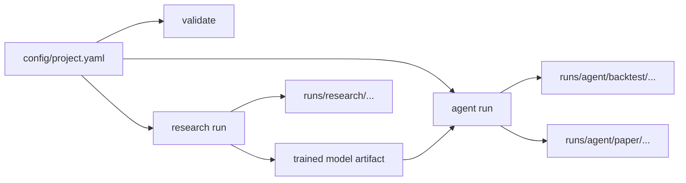

# QuantTradeAI

> Quant research workflows and trading agents from one YAML project.

QuantTradeAI is a YAML-first, CLI-first framework for traders, researchers, and developers who want a practical path from market data to research runs, backtests, and trading agents. The happy path is intentionally simple: define one project, run it from the CLI, and inspect standardized artifacts for every run.

[Getting Started](docs/getting-started.md) | [Project YAML](docs/configuration/project-yaml.md) | [Quick Reference](docs/quick-reference.md) | [Configuration](docs/configuration.md) | [Roadmap](roadmap.md) | [Contributing](CONTRIBUTING.md)

> [!TIP]
> New users should start with `config/project.yaml`. It is the canonical entrypoint for `init`, `validate`, `research run`, and `agent run`.

## Start Here

- Want the fastest working path? Jump to [Research In 4 Commands](#research-in-4-commands)
- Already have a trained model? Jump to [Run A Model Agent](#run-a-model-agent)
- Evaluating prompt-driven agents? Jump to [Backtest An LLM Agent](#backtest-an-llm-agent)
- Need the full config shape? Jump to [What A Project Looks Like](#what-a-project-looks-like)
- Comparing current capabilities? Jump to [Current Support](#current-support)

## Why QuantTradeAI

- **One project file**: keep research and agents in the same `config/project.yaml`
- **One clear CLI**: initialize, validate, run research, and run agents with a small command surface
- **Shared primitives**: reuse symbols, features, and time windows across workflows
- **Run visibility by default**: each run writes resolved configs, metrics, and artifacts to disk
- **YAML first, Python extendable**: common workflows require little or no framework code

## At A Glance

| I want to... | Best path today | What I get |
| --- | --- | --- |
| Research a strategy end to end | `init` -> `validate` -> `research run` | Time-aware evaluation, backtests, metrics, run records |
| Run a trained model as an agent | `init --template model-agent` -> `agent run --mode backtest|paper` | One YAML-defined agent that can be backtested and paper-run |
| Backtest an LLM agent | `init --template llm-agent` -> `agent run --mode backtest` | Prompt-driven agent logic using project config |
| Backtest a hybrid agent | `init --template hybrid` -> `research run` -> `agent run --mode backtest` | Model signals plus LLM reasoning in one project |
| Keep using the older live loop | `live-trade` with runtime YAML files | Legacy compatibility for existing setups |

## How It Fits Together



QuantTradeAI is one framework with two connected tracks:

- **Research**: data -> features -> labels -> training -> evaluation -> backtest -> run records
- **Agents**: YAML-defined `model`, `llm`, and `hybrid` agents that reuse the same project definitions

## Current Support

| Workflow | Status |
| --- | --- |
| `research run` from `project.yaml` | Supported |
| `agent run` for `model` agents in `backtest` | Supported |
| `agent run` for `model` agents in `paper` | Supported |
| `agent run` for `llm` and `hybrid` agents in `backtest` | Supported |
| `agent run` for `llm` and `hybrid` agents in `paper` | Roadmap |
| `rule` agents | Roadmap |
| Deployment and promotion UX | Roadmap |

> [!NOTE]
> `live-trade` still exists for legacy runtime YAML workflows. It does not read `config/project.yaml`.

## Install In 2 Minutes

QuantTradeAI requires Python `3.11+`.

```bash
git clone https://github.com/AKKI0511/QuantTradeAI.git
cd QuantTradeAI
poetry install --with dev
poetry run quanttradeai --help
```

If you prefer a package install, `pip install .` also works.

## Fastest Working Paths

### Research In 4 Commands

Use this if you want the simplest end-to-end quant workflow.

```bash
poetry run quanttradeai init --template research -o config/project.yaml
poetry run quanttradeai validate -c config/project.yaml
poetry run quanttradeai research run -c config/project.yaml
poetry run quanttradeai runs list
```

This path gives you:

- a canonical project config
- resolved-config validation output
- a research run with metrics and artifacts
- standardized outputs under `runs/research/...`

### Run A Model Agent

Use this if you already have a trained model artifact and want one YAML-defined agent that can run in both backtest and paper mode.

```bash
poetry run quanttradeai init --template model-agent -o config/project.yaml
poetry run quanttradeai validate -c config/project.yaml

# Replace models/trained/aapl_daily_classifier/ with a real trained model artifact

poetry run quanttradeai agent run --agent paper_momentum -c config/project.yaml --mode backtest
poetry run quanttradeai agent run --agent paper_momentum -c config/project.yaml --mode paper
```

> [!IMPORTANT]
> The `model-agent` template creates a placeholder model directory so the project structure is obvious. Replace it with a real trained model artifact before running the agent.

### Backtest An LLM Agent

Use this if you want prompt-driven agent logic from YAML.

```bash
poetry run quanttradeai init --template llm-agent -o config/project.yaml
poetry run quanttradeai validate -c config/project.yaml
poetry run quanttradeai agent run --agent breakout_gpt -c config/project.yaml --mode backtest
```

### Backtest A Hybrid Agent

Use this if you want to combine trained model signals and LLM reasoning in one project.

```bash
poetry run quanttradeai init --template hybrid -o config/project.yaml
poetry run quanttradeai research run -c config/project.yaml
poetry run quanttradeai agent run --agent hybrid_swing_agent -c config/project.yaml --mode backtest
```

## What A Project Looks Like

The happy path is centered on `config/project.yaml`.

```yaml
project:
  name: "intraday_lab"
  profile: "paper"

data:
  symbols: ["AAPL"]
  start_date: "2022-01-01"
  end_date: "2024-12-31"
  timeframe: "1d"
  test_start: "2024-09-01"
  test_end: "2024-12-31"

features:
  definitions:
    - name: "rsi_14"
      type: "technical"
      params: { period: 14 }

agents:
  - name: "paper_momentum"
    kind: "model"
    mode: "paper"
    model:
      path: "models/trained/aapl_daily_classifier"
```

For the full shape, field reference, and supported agent modes, see [Project YAML](docs/configuration/project-yaml.md).

## What You Get After Each Run

| Workflow | Output directory | Typical artifacts |
| --- | --- | --- |
| Research | `runs/research/<timestamp>_<project>/` | `resolved_project_config.yaml`, runtime YAML snapshots, `summary.json`, `metrics.json`, backtest artifacts |
| Agent backtest | `runs/agent/backtest/<timestamp>_<agent>/` | `resolved_project_config.yaml`, `summary.json`, `metrics.json`, `decisions.jsonl`, backtest files |
| Agent paper | `runs/agent/paper/<timestamp>_<agent>/` | `resolved_project_config.yaml`, `summary.json`, `metrics.json`, `executions.jsonl`, runtime YAML snapshots |

This makes it easier to compare runs, audit what actually executed, and reuse winning configurations.

## Documentation Map

### Start Here

- [Getting Started](docs/getting-started.md)
- [Quick Reference](docs/quick-reference.md)

### Configuration

- [Configuration Overview](docs/configuration.md)
- [Project YAML](docs/configuration/project-yaml.md)
- [Runtime and Live Trading Configs](docs/configuration/live-runtime-files.md)
- [Legacy Config Compatibility](docs/configuration/legacy-configs.md)

### Reference

- [API Docs](docs/api/)
- [Docs Index](docs/README.md)

### Product Direction

- [Roadmap](roadmap.md)

## Legacy Compatibility

`config/project.yaml` is the recommended path for new work. Legacy workflows remain available for compatibility, especially for saved-model backtests and the older live trading loop.

```bash
poetry run quanttradeai fetch-data -c config/model_config.yaml
poetry run quanttradeai train -c config/model_config.yaml
poetry run quanttradeai evaluate -m <model_dir> -c config/model_config.yaml
poetry run quanttradeai backtest-model -m <model_dir> -c config/model_config.yaml -b config/backtest_config.yaml
poetry run quanttradeai live-trade -m <model_dir> -c config/model_config.yaml -s config/streaming.yaml
poetry run quanttradeai validate-config
```

Important boundary:

- `agent run --mode paper` for project-defined `model` agents compiles runtime config from `config/project.yaml`
- `live-trade` still uses the runtime YAML files directly

## Development

```bash
poetry install --with dev
make format
make lint
make test
```

## Contributing

See [CONTRIBUTING.md](CONTRIBUTING.md).

## License

MIT. See [LICENSE](LICENSE).
